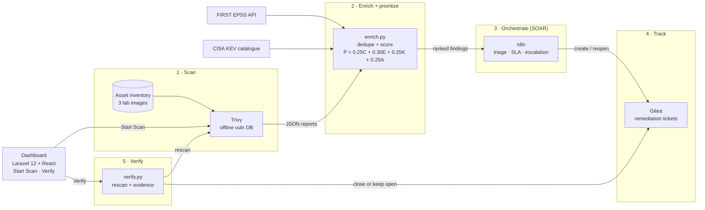
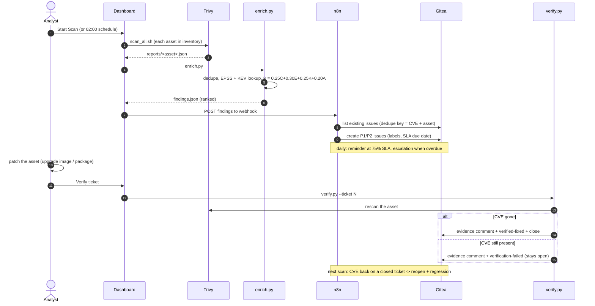
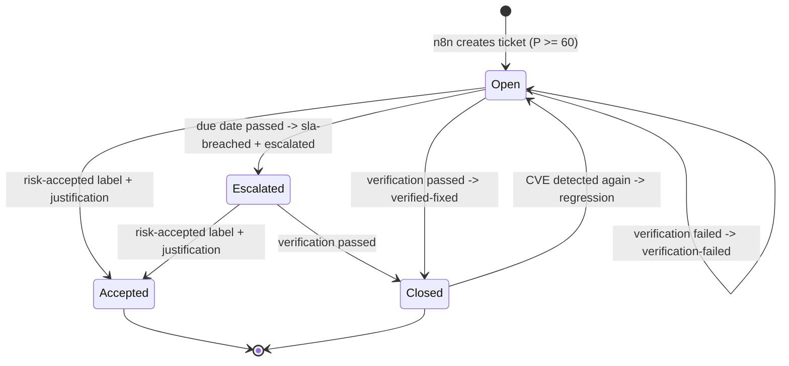
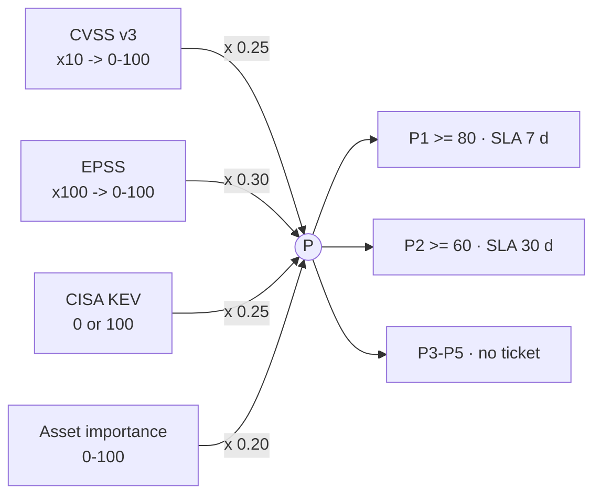

# Architecture

## 1. Components

```mermaid
flowchart LR
    DASH["Dashboard<br/>Laravel 12 + React<br/>Start Scan · Verify"]
    subgraph A["1 · Scan"]
        INV[("Asset inventory<br/>3 lab images")] --> TRIVY["Trivy<br/>offline vuln DB"]
    end
    subgraph B["2 · Enrich + prioritize"]
        ENR["enrich.py<br/>dedupe + score<br/>P = 0.25C + 0.30E + 0.25K + 0.20A"]
    end
    subgraph C["3 · Orchestrate (SOAR)"]
        N8N["n8n<br/>triage · SLA · escalation"]
    end
    subgraph D["4 · Track"]
        GITEA["Gitea<br/>remediation tickets"]
    end
    subgraph E["5 · Verify"]
        VER["verify.py<br/>rescan + evidence"]
    end
    EPSS["FIRST EPSS API"] --> ENR
    KEV["CISA KEV catalogue"] --> ENR
    TRIVY -- "JSON reports" --> ENR
    ENR -- "ranked findings" --> N8N
    N8N -- "create / reopen" --> GITEA
    DASH -- "Start Scan" --> TRIVY
    DASH -- "Verify" --> VER
    VER -- "rescan" --> TRIVY
    VER -- "close or keep open" --> GITEA
```

## 2. End-to-end flow (scan -> ticket -> fix -> proof)

```mermaid
sequenceDiagram
    autonumber
    actor Analyst
    participant D as Dashboard
    participant T as Trivy
    participant E as enrich.py
    participant N as n8n
    participant G as Gitea
    participant V as verify.py

    Analyst->>D: Start Scan (or 02:00 schedule)
    D->>T: scan_all.sh (each asset in inventory)
    T-->>D: reports/<asset>.json
    D->>E: enrich.py
    E->>E: dedupe, EPSS + KEV lookup, P = 0.25C+0.30E+0.25K+0.20A
    E-->>D: findings.json (ranked)
    D->>N: POST findings to webhook
    N->>G: list existing issues (dedupe key = CVE + asset)
    N->>G: create P1/P2 issues (labels, SLA due date)
    Note over N,G: daily: reminder at 75% SLA, escalation when overdue
    Analyst->>Analyst: patch the asset (upgrade image / package)
    Analyst->>D: Verify ticket
    D->>V: verify.py --ticket N
    V->>T: rescan the asset
    alt CVE gone
        V->>G: evidence comment + verified-fixed + close
    else CVE still present
        V->>G: evidence comment + verification-failed (stays open)
    end
    Note over N,G: next scan: CVE back on a closed ticket -> reopen + regression
```

## 3. Ticket lifecycle

```mermaid
stateDiagram-v2
    [*] --> Open: n8n creates ticket (P >= 60)
    Open --> Open: SLA 75% -> sla-warning
    Open --> Escalated: due date passed -> sla-breached + escalated
    Escalated --> Closed: verification passed
    Open --> Open: verification failed -> verification-failed
    Open --> Closed: verification passed -> verified-fixed
    Open --> Accepted: risk-accepted label + justification
    Escalated --> Accepted: risk-accepted label + justification
    Closed --> Open: CVE detected again -> regression
    Accepted --> [*]
    Closed --> [*]
```

## 4. Priority model

```mermaid
flowchart LR
    C["CVSS v3<br/>x10 -> 0-100"] -- "x 0.25" --> P(("P"))
    E["EPSS<br/>x100 -> 0-100"] -- "x 0.30" --> P
    K["CISA KEV<br/>0 or 100"] -- "x 0.25" --> P
    A["Asset importance<br/>0-100"] -- "x 0.20" --> P
    P --> L1["P1 >= 80 · SLA 7 d"]
    P --> L2["P2 >= 60 · SLA 30 d"]
    P --> L3["P3-P5 · no ticket"]
```
